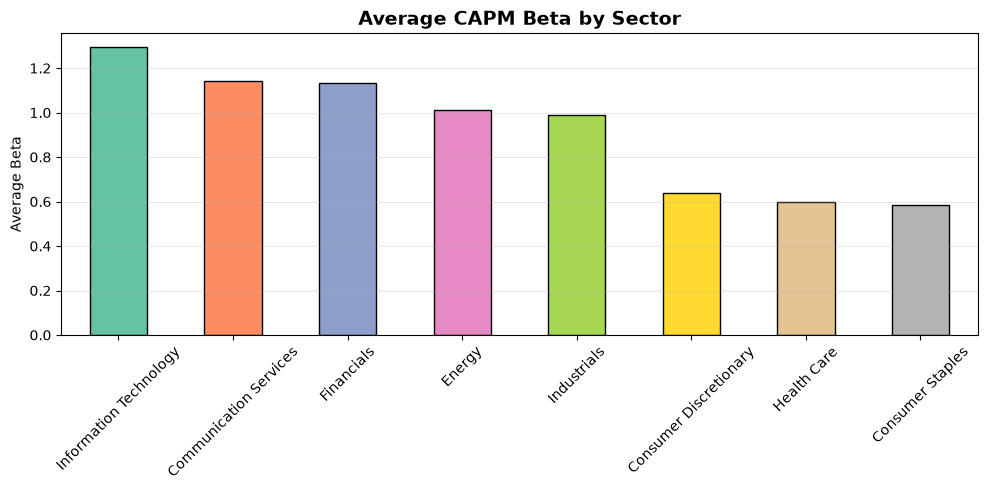
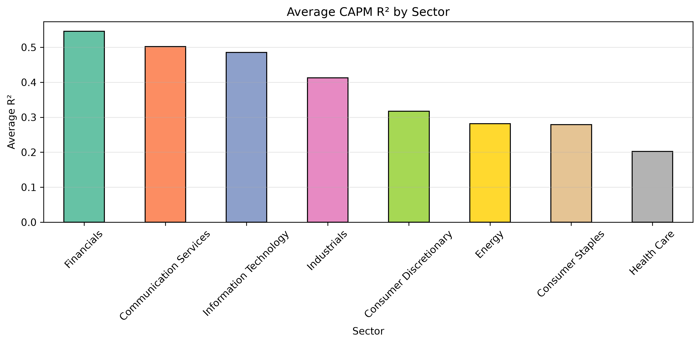
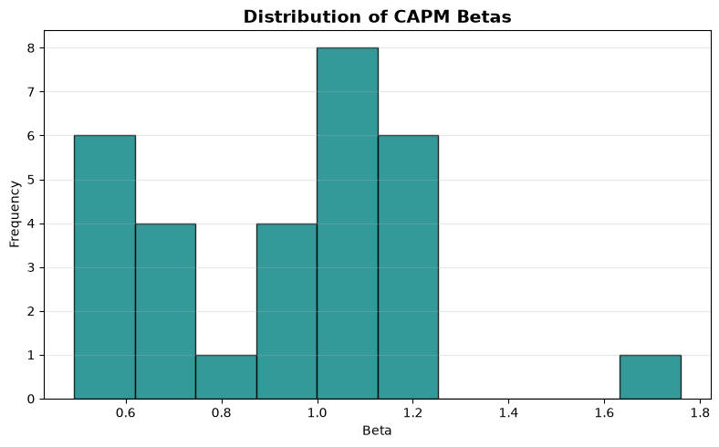
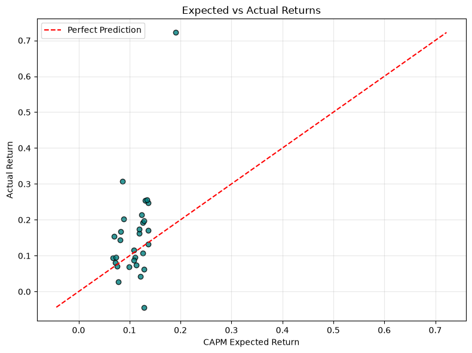

# CAPM Empirical Analysis

### Testing the Capital Asset Pricing Model (CAPM) Using Historical Data from 30 S&P 500 Companies (2015–2025)

An empirical finance project that evaluates the predictive performance of the Capital Asset Pricing Model (CAPM) using historical market data. The project estimates stock betas through Ordinary Least Squares (OLS) regression, compares systematic risk across sectors, and validates CAPM by comparing expected returns with realized annualized returns.

---

## Project Overview

The Capital Asset Pricing Model (CAPM) is one of the most widely used asset pricing models in finance, relating a stock's expected return to its systematic market risk.

Although CAPM remains a cornerstone of portfolio theory, its empirical performance in modern equity markets is often debated. This project investigates whether CAPM continues to explain realized returns by analyzing daily historical data from 30 large-cap S&P 500 companies across eight sectors over an 11-year period.

The analysis estimates stock betas, evaluates sector-wise differences in systematic risk, and measures how closely CAPM-implied expected returns align with realized market performance.

---

## Research Question

> **How well does the Capital Asset Pricing Model explain realized stock returns across different sectors of the S&P 500?**

To answer this question, the project investigates:

- Estimation of stock beta using OLS regression
- Sector-wise comparison of systematic market risk
- Statistical significance of alpha estimates
- CAPM expected returns versus realized annualized returns
- Pricing errors across individual companies
- Sector-wise explanatory power using R²

---

## Dataset

Historical market data was collected using **Yahoo Finance (yfinance)**.

### Assets Included

- 30 S&P 500 companies
- S&P 500 Index (^GSPC) as the market portfolio
- 3-Month Treasury Bill (^IRX) as the risk-free rate

### Sample Period

**January 2015 – December 2025**

Companies were selected across multiple GICS sectors, including:

- Information Technology
- Financials
- Health Care
- Energy
- Industrials
- Consumer Staples
- Consumer Discretionary
- Communication Services

---

## Methodology

### 1. Data Collection

- Downloaded adjusted daily closing prices
- Retrieved S&P 500 index data
- Retrieved historical Treasury Bill yields

### 2. Data Processing

- Computed daily percentage returns
- Converted Treasury Bill yields into daily risk-free returns
- Calculated excess stock and market returns

### 3. CAPM Regression

For each company, the following regression was estimated using Ordinary Least Squares (OLS):

> **Rᵢ − R𝒇 = α + β(Rₘ − R𝒇) + ε**

The following statistics were extracted:

- Alpha
- Beta
- Alpha p-value
- Beta p-value
- R²

### 4. Sector Analysis

Estimated betas were grouped by sector to compare systematic risk across industries.

### 5. CAPM Validation

Expected returns were calculated using:

> **E(Rᵢ) = R𝒇 + β(Rₘ − R𝒇)**

These expected returns were then compared with realized annualized returns to quantify pricing errors and evaluate CAPM's predictive performance.

---

# Key Findings

### Sector-wise Market Risk

- **Information Technology** exhibited the highest average market sensitivity (**β = 1.29**), followed by **Communication Services (β = 1.14)** and **Financials (β = 1.13)**.
- **Consumer Staples (β = 0.58)** and **Health Care (β = 0.60)** displayed the lowest systematic risk, consistent with their traditionally defensive characteristics.

---

### CAPM Explanatory Power

Average R² varied considerably across sectors.

| Sector | Average R² |
|---------|-----------:|
| Financials | **0.546** |
| Communication Services | 0.502 |
| Information Technology | 0.485 |
| Industrials | 0.413 |
| Consumer Discretionary | 0.317 |
| Energy | 0.282 |
| Consumer Staples | 0.279 |
| Health Care | **0.202** |

Financial stocks were explained most effectively by CAPM, whereas Health Care companies showed substantially lower explanatory power, suggesting that factors beyond market beta play a larger role.

---

### Alpha Significance

Only **5 out of 30** companies produced statistically significant alpha estimates at the 5% significance level:

- COST
- GOOGL
- LLY
- MSFT
- NVDA

For the remaining companies, abnormal returns were not statistically distinguishable from zero, indicating that market beta explained a substantial portion of observed returns.

---

### Pricing Errors

Comparison of CAPM-implied expected returns with realized annualized returns revealed considerable variation.

Largest positive pricing errors:

| Stock | Pricing Error |
|-------|--------------:|
| NVDA | **+53.2%** |
| LLY | +22.0% |
| GOOGL | +12.3% |
| MSFT | +12.2% |
| COST | +11.5% |

Largest negative pricing errors:

| Stock | Pricing Error |
|-------|--------------:|
| SLB | **−17.2%** |
| EOG | −7.9% |
| COP | −6.5% |
| PFE | −5.1% |
| CVX | −4.0% |

These deviations illustrate that while CAPM captures broad market risk, company-specific and sector-specific factors continue to influence realized returns.

---

# Visual Results

## Sector-wise Average Beta

Technology and Communication Services exhibited the highest systematic risk, whereas Consumer Staples and Health Care remained comparatively defensive.

<p align="center">

</p>

---

## Sector-wise CAPM Explanatory Power

The figure below compares the average coefficient of determination (R²) across sectors. Higher R² values indicate that CAPM explains a larger proportion of stock return variation within that sector.

Financials exhibited the highest average R², suggesting that market movements accounted for a greater share of return variability. In contrast, Health Care and Consumer Staples recorded the lowest average R² values, indicating that sector-specific factors beyond market risk played a larger role in driving returns.

<p align="center">

</p>

---

## Distribution of Estimated Betas

Most companies exhibited beta values close to one, indicating moderate sensitivity to overall market movements, with relatively few extreme observations.

<p align="center">

</p>

---

## CAPM Expected vs. Realized Returns

The scatter plot compares CAPM-implied expected returns with realized annualized returns.

If CAPM perfectly explained stock performance, observations would lie on the 45° reference line. While several companies closely follow this trend, notable deviations—particularly NVIDIA and SLB—highlight the limitations of relying solely on a single market risk factor.

<p align="center">

</p>

---

# Repository Structure

```text
capm-empirical-analysis/
│
├── data/
│   ├── raw/
│   └── processed/
│
├── figures/
│
├── notebooks/
│   ├── 01_data_processing.ipynb
│   ├── 02_beta.ipynb
│   ├── 03_capm.ipynb
│   └── 04_capm_validation.ipynb
│
├── README.md
└── requirements.txt
```

---

# Technologies Used

- Python
- Pandas
- NumPy
- Statsmodels
- Matplotlib
- yfinance
- Jupyter Notebook

---

# Running the Project

Clone the repository:

```bash
git clone https://github.com/<your-username>/capm-empirical-analysis.git
```

Install dependencies:

```bash
pip install -r requirements.txt
```

Run the notebooks sequentially:

1. 01_data_processing.ipynb
2. 02_beta.ipynb
3. 03_capm.ipynb
4. 04_capm_validation.ipynb

---

# Future Work

Possible extensions include:

- Fama–French Three-Factor and Five-Factor Models
- Rolling beta estimation
- Portfolio-level CAPM analysis
- Time-varying beta models
- Out-of-sample validation across different market regimes
- Expanding the study to the complete S&P 500 universe

---

# References

- Sharpe, W. F. (1964). *Capital Asset Prices: A Theory of Market Equilibrium under Conditions of Risk.*
- Yahoo Finance
- Statsmodels Documentation
